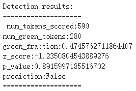
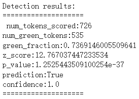

# AudioCraft (MusicGen) with Watermark
This repository add watermarks to music generated by MusicGen by Meta based on the white-box watermarking algorithm in the paper "A Watermark for Large Language Models".

To learn more about the official code and paper, please see
1. MusicGen's official code: [facebookresearch/audiocraft](https://github.com/facebookresearch/audiocraft)
2. Watermark: [jwkirchenbauer/lm-watermarking](https://github.com/jwkirchenbauer/lm-watermarking)

## Quick Start
1. You can run a quick demo on colab: [colab notebook](https://colab.research.google.com/drive/1l6UHDukS517uGeU8nzMtaf2TY4GJA5i7?usp=sharing)
2. Run demo at `watermark/musicgen_watermark_demo.ipynb` locally if you have installed dependencies
3. Run more tests at `watermark/audio_watermark_demo.py` locally

## Dependencies
Please see the two official repository first.
1. For MusicGen, don't directly `pip install -U audiocraft`, which will install the official code. Instead, clone this repository and use `python -m pip install -e .`
2. For watermarking, you don't need to install special dependencies, just `transformers` and `nltk`

## Implementation Details

### Watermarking and detecting modules
The original code can be found in [jwkirchenbauer/lm-watermarking](https://github.com/jwkirchenbauer/lm-watermarking) and this repository copies them into `watermark` directory.

This work doesn't modify the original code but add a new class `WatermarkAudioDetector` in `watermark_processor.py`, which uses Encodec to convert audio into codebooks rather than uses tokenizers to convert text into token ids.

### Modifications of MusicGen
1. `audiocraft/models/lm.py`
    The language model used by MusicGen is modified. Before sampling in `_sample_next_token()`, there is watermarking processing for the logits. Some necessary variables are set in `__init__()`.

    > Pay attention: only one of codebooks is used to generate watermarks (default codebook is the first one). 

2. `audiocraft/models/musicgen.py`
    Set `watermark_mode` in `set_generation_params()` to determine whether to add watermarks.

## Results and limitations
This work only tests MusicGen and it can successfully add and detect watermarks in my testing cases. 

For example, the colab demo uses "Bluesy guitar instrumental with soulful licks and a driving rhythm section" as prompt to generate audio. The first picture is without watermark and the second one is with watermark. We can see it can detect watermark properly.

The quality of watermarked music will be influenced. Some watermarked music sounds as good as the music without watermark, while some doesn't.

In addition, compression model (`Encodec`) of MusicGen is a lossy method, which means the codebook (token IDs) used to add watermarks won't be the same as that used to detect watermarks. After my experiments, the error rate will be around 25%, which may impact the accuracy of watermark detection, but fortunately, the detection still works if we set appropriate parameters for watermarking.

## Contributing

 Suggestions and discussions are welcome. 🙂
